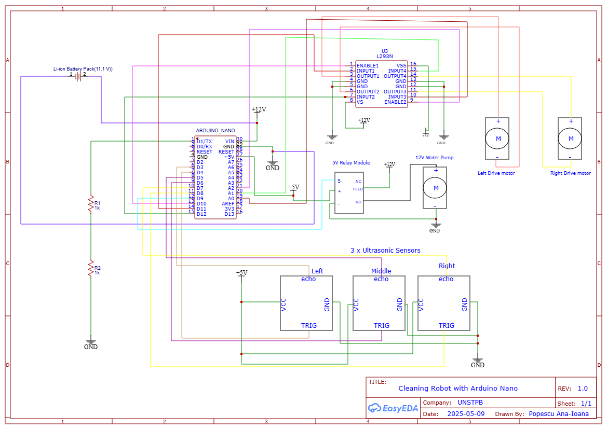

<h1>🤖 Robot Autonome de Nettoyage de Sols 🧹</h1>

## Description

<p>Ce robot autonome est conçu pour nettoyer les sols à l'aide d'un système de serpillière rotative et d'une pompe à eau pour l'humidification. Contrôlé par un <strong>Arduino Nano</strong>, le robot peut eviter les obstables à partir de 20 cm.</p>

<p>Le robot se déplace à l'aide de deux moteurs avec réducteur et évite les obstacles grâce à des capteurs à ultrasons. L'eau est pulvérisée sur le sol via un tuyau connecté à une petite bouteille faisant office de réservoir, tandis que la serpillière rotative nettoie efficacement la surface.</p>

<p>L'appareil est alimenté par des batteries <strong>lithium-ion</strong> et intègre des éléments de sécurité comme un interrupteur général et des boutons dédiés pour l'allumage et l'arrêt.</p>

<p>Pour plus de détails et une démonstration pratique, consultez cette vidéo :<br>
📺 <a href="https://youtu.be/ecNfo2phP6g?si=pkN76e_93W3H9zNL" target="_blank">Démo Robot de Nettoyage de Sols</a></p>

## Motivation

<p> Ce projet est né de ma volonté de simplifier les tâches ménagères à la maison, ou au quotidien. En tant qu'étudiante passionnée par l'électronique et la programmation embarquée, ce projet me permet de mettre en pratique mes compétences tout en créant un outil utile pour la maison.</p>

## Architecture

<p>J’ai construit ce robot autour d’une carte <strong>Arduino Nano</strong> en y intégrant plusieurs modules essentiels :</p>

<ul>
  <li><strong>🔁Un driver L293N</strong> pour contrôler deux moteurs à courant continu</li>
  <li><strong>📏Trois capteurs à ultrasons HC-SR04</strong> (gauche, milieu, droite) pour détecter les obstacles</li>
  <li><strong>Un module relais 5V</strong> pour activer une pompe à eau</li>
  <li><strong>🌊Une pompe 12V</strong> pour pulvériser l’eau sur le sol</li>
  <li><strong>🔋 Une batterie 12V</strong> pour alimenter les moteurs et la pompe</li>
  <li><strong>🔌Un régulateur 5V</strong> pour fournir l’alimentation de la carte Arduino et des capteurs</li>
  <li><strong>🧠Code intelligent</strong> avec gestion des distances et des réactions</li>
</ul>

<p>J’ai veillé à ce que tous les composants partagent une masse commune (GND) pour garantir la stabilité électrique.</p>

<hr>

<h2>🔧 Composants nécessaires</h2>

<table border="1" cellspacing="0" cellpadding="6">
  <thead>
    <tr>
      <th>Produit</th>
      <th>Quantité</th>
      <th>Prix unitaire</th>
      <th>Prix total</th>
    </tr>
  </thead>
  <tbody>
    <tr><td>Carte de développement Arduino Nano + câble</td><td>1</td><td>29,36 lei</td><td>29,36 lei</td></tr>
    <tr><td>Capteur à ultrasons HC-SR04</td><td>3</td><td>6,49 lei</td><td>19,47 lei</td></tr>
    <tr><td>Moteur avec réducteur et roue</td><td>2</td><td>14,99 lei</td><td>29,98 lei</td></tr>
    <tr><td>Résistance 1.8KΩ 0.25W</td><td>5</td><td>0,10 lei</td><td>0,50 lei</td></tr>
    <tr><td>Résistance 1KΩ 0.25W</td><td>5</td><td>0,10 lei</td><td>0,50 lei</td></tr>
    <tr><td>Résistance 10KΩ 0.25W</td><td>5</td><td>0,10 lei</td><td>0,50 lei</td></tr>
    <tr><td>Pompe à eau/air à diaphragme 12V</td><td>1</td><td>27,93 lei</td><td>27,93 lei</td></tr>
    <tr><td>Support accumulateur 18650 3S</td><td>1</td><td>4,25 lei</td><td>4,25 lei</td></tr>
    <tr><td>Module relais 5V</td><td>1</td><td>6,55 lei</td><td>6,55 lei</td></tr>
    <tr><td>Plaque d'essai 400 points (breadboard)</td><td>1</td><td>6,37 lei</td><td>6,37 lei</td></tr>
    <tr><td>Régulateur de tension LM7805</td><td>1</td><td>2,03 lei</td><td>2,03 lei</td></tr>
    <tr><td>Barrette de broches mâles 2.54</td><td>1</td><td>2,02 lei</td><td>2,02 lei</td></tr>
    <tr><td>Barrette de broches femelles 2.54</td><td>1</td><td>1,00 lei</td><td>1,00 lei</td></tr>
    <tr><td>Connecteur PCB 2 broches 5mm</td><td>1</td><td>1,21 lei</td><td>1,21 lei</td></tr>
    <tr><td>40 câbles Dupont M-M 10 cm</td><td>1</td><td>7,60 lei</td><td>7,60 lei</td></tr>
    <tr><td>Support pour capteur ultrasons HC-SR04</td><td>3</td><td>4,95 lei</td><td>14,85 lei</td></tr>
    <tr><td>40 câbles Dupont F-M 30 cm</td><td>1</td><td>7,94 lei</td><td>7,94 lei</td></tr>
    <tr><td>Plaque PCB prototype 7x9</td><td>1</td><td>6,21 lei</td><td>6,21 lei</td></tr>
    <tr><td>Support accumulateur 18650 1S</td><td>3</td><td>1,71 lei</td><td>5,13 lei</td></tr>
    <tr><td>Interrupteur KCD11 2 broches</td><td>1</td><td>0,62 lei</td><td>0,62 lei</td></tr>
    <tr><td>Plaque PCB prototype 9x15</td><td>1</td><td>10,03 lei</td><td>10,03 lei</td></tr>
    <tr><td>Tuyau 6x8mm pour pompe à eau</td><td>1</td><td>6,26 lei</td><td>6,26 lei</td></tr>
    <tr><td>Barrette femelle 2.54 (x3)</td><td>3</td><td>1,00 lei</td><td>3,00 lei</td></tr>
    <tr><td>Barrette mâle 2.54 (x2)</td><td>2</td><td>2,02 lei</td><td>4,04 lei</td></tr>
    <tr><td>Driver Moteur</td><td>1</td><td>11 lei</td><td>11 lei</td></tr>
    <tr><td>Tête de serpillière rotative</td><td>1</td><td>-</td><td>-</td></tr>
    <tr><td>Petite bouteille d'eau (réservoir) - 200 ml</td><td>1</td><td>-</td><td>-</td></tr>
  </tbody>
</table>

---

## 🖥️ Schéma électrique

Ce schéma illustre toutes les connexions entre les composants, incluant :
- l’alimentation 11.1V vers Arduino, relais et moteur
- les liaisons entre capteurs, L293N et la carte Arduino
- les masses communes pour assurer la stabilité du système



---


## Diagramme fonctionnel (block diagram)

```text
           +--------------------+
           |    Batterie 12V    |
           +---------+----------+
                     |
                +----v----+
                | L293N    |<-------------+----------------+
                | Motor    |              |                |
                | Driver   |          +---v---+        +---v---+
                +----+-----+          | Moteur|        | Moteur|
                     |                | gauche|        | droit |
                     |                +-------+        +-------+
                     |
               +-----v------+
               | Arduino    |
               | Nano       |
               +------------+
              /   |   |   \  
             /    |   |    \ 
   +--------v+ +--v--+ +--v--+ +--------v--------+
   | Capteur | |Captr| |Captr| |   Pin Sortie    |
   | gauche  | |milieu| |droite| | vers relais    |
   +---------+ +------+ +------+ +--------+--------+
                                         |
                                    +----v----+
                                    | Relais   |
                                    |  5V      |
                                    +----+-----+
                                         |
                                    +----v----+
                                    | Pompe    |
                                    |  12V     |
                                    +---------+
```

# Projet Robot de Nettoyage

## Librairies

J’ai utilisé l’IDE Arduino et je l’ai initialisé pour un bon fonctionnement.

| **Librairie** | **Description**                              | **Utilisation**                                                           |
|---------------|----------------------------------------------|---------------------------------------------------------------------------|
| **NewPing**   | Librairie pour capteurs à ultrasons          | Utilisée pour mesurer les distances avec les capteurs HC-SR04.           |

---

## Journal de développement

| **Semaine** | **Période**     | **Résumé**                                                                                     |
|-------------|-----------------|------------------------------------------------------------------------------------------------|
| Semaine 6   | 6 - 12 mai       | Configuration initiale du robot et du matériel.                                                |
| Semaine 7   | 13 - 19 mai      | Développement de la logique en mode automatique basée sur les capteurs à ultrasons.           |
| Semaine 8   | 20 - 26 mai      | Ajustement du contrôle des moteurs et de la détection d’obstacles. Tests finaux réalisés.     |

---

## Aperçu du Code

### Initialisation des broches

- **Capteurs à ultrasons :**
  - `echo_L`, `trig_L` : capteur gauche.
  - `echo_M`, `trig_M` : capteur central.
  - `echo_R`, `trig_R` : capteur droit.
  
- **Contrôle des moteurs :**
  - `L1`, `L2`, `R1`, `R2` : broches utilisées pour commander les moteurs gauche et droit.
  
- **Pompe :**
  - `pump` : broche utilisée pour activer ou désactiver la pompe à eau.

---

### Contrôle des moteurs

- Le robot utilise deux moteurs pour se déplacer vers l’avant, l’arrière, à gauche ou à droite.
- La vitesse est contrôlée via des signaux PWM (valeurs comprises entre 125 et 255).
- La variable `motor_speed` permet de définir cette vitesse.

---

### Mode automatique

En **mode automatique**, le robot utilise trois capteurs à ultrasons pour détecter les obstacles.

- Si un obstacle est détecté à moins de 20 cm par le capteur central :
  - Le robot choisit la direction avec le plus d’espace (gauche ou droite).
  - Si les deux côtés sont bloqués, il recule.
- S’il n’y a pas d’obstacles, il continue d’avancer.

---

### Lecture des capteurs

- Chaque capteur utilise la fonction `ping_cm()` de la librairie **NewPing** pour mesurer la distance.
- Si aucune réponse n’est détectée, la distance est estimée à `250 cm` (valeur par défaut).
